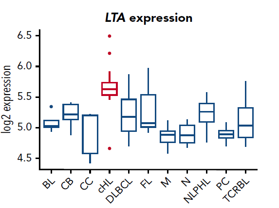

# Introduction to experiment

Classical Hodgkin lymphoma (cHL) is a type of cancer in which tumour originates in lymphocytes. Diagnosis involves finding Hodgkin/Reed-Sternberg (HRS) cells in lymph nodes. Common causes of cHL include genomic lesions, Epstein-Barr virus infections, soluble factors and other tumour-microenvironment interactions. 

Presented experiment **(von Hoff, et al. 2019)** sets out to identify cHL cell-secreted key factors that lead to NF-$\kappa$B activation, creating a feedback loop which ultimately supports tumour growth. cHL cell cultures have been investigated using chromatography and mass spectroscopy techniques. 

Lymphotoxin-$\alpha$ coded by gene *LTA* is a cytokine which violates regulation of NF-$\kappa$B as well as JAK2/STAT6 signalling pathway. Targeting *LTA* is a hopeful treatment strategy for cHL patients.

<p align="center">
  
</p>

Experimental data include 9 samples from L-1236 cell line ([Cell line description](https://web.expasy.org/cellosaurus/CVCL_2096)) with following phenotypes:
  
  - wild type phenotype
  - CRISPR/Cas9 mediated knockout of second LTA exon
  - CRISPR/Cas9 mediated knockout of fourth LTA exon
  
  [Link to article](https://ashpublications.org/blood/article/133/13/1489/261463/Autocrine-LTA-signaling-drives-NF-B-and-JAK-STAT)
  
# Configuration

```{r, eval=TRUE, results='hide', warning=FALSE, message=FALSE}
library(here)
library(dplyr)
library(stringr)
library(glue)
library(oligo)
library(DT)
library(ggplot2)
library(ggpubr)
library(AnnotationDbi)
library(dendextend)
library(heatmaply)
library(janitor)
library(stringr)
library(limma)
library(ComplexHeatmap)

source(here("age_library.R"))
```

```{r, eval=TRUE}
DATA_DIR <- here("data")
EXPERIMENT_SAMPLE_SHEET_FILE <- here(DATA_DIR, "E-MTAB-6896.sdrf.txt.txt")
```

```{r,eval=TRUE, message=FALSE, warning=FALSE}
pheno_data <- readr::read_delim(EXPERIMENT_SAMPLE_SHEET_FILE, delim = "\t", progress = FALSE) %>% 
  dplyr::select(., c("Source Name", "Characteristics[genotype]", "Array Data File")) %>%
  magrittr::set_colnames(c("sample_name", "sample_group", "cel_file"))  %>% 
  as.data.frame() %>%
  magrittr::set_rownames(.$sample_name) %>%
  dplyr::mutate(sample_group = str_replace_all(sample_group, "lentiCRIPSPR_v2-", "")) %>%
  dplyr::mutate(sample_group = str_replace_all(sample_group, " genotype", ""))

DT::datatable(head(pheno_data), options = list(scrollX = TRUE))
pheno_data$sample_group <- as.factor(pheno_data$sample_group)

```

```{r, eval=TRUE, results='hide', warning=FALSE, message=FALSE}
cel_files <- glue("{DATA_DIR}/{pheno_data$cel_file}")
raw_data <- read.celfiles(cel_files)
```

```{r, eval=TRUE}
sampleNames(raw_data)
```
```{r, eval=TRUE}
sampleNames(raw_data) <- pheno_data$sample_name

metadata <- data.frame(
  labelName = colnames(pheno_data),
  labelDescription = c("", "Genotype", "")
)

DT::datatable(metadata)
```
```{r, eval=TRUE}
(pheno_data <- AnnotatedDataFrame(data = pheno_data, varMetadata = metadata))
```
```{r, eval=TRUE}
phenoData(raw_data) <- Biobase::combine(phenoData(raw_data), pheno_data)
DT::datatable(pData(raw_data) %>% head(), options = list(scrollX = TRUE))
```


# Technical quality check

## Pseudo-image

```{r,eval=TRUE}
image(raw_data, which = 9, transfo = log2)
```

The pseudo-image looks more or less okay except the rectangular area which seems to be of the same shade of blue. Let's investigate a little more.

## MA-plot

```{r, eval=TRUE}
MAplot(raw_data, groups = pData(raw_data)$sample_group, pairs = TRUE)
```

MA-plots seem more or less okay. Obviously there are some outliers but majority is around the central line. 

## Boxplots

```{r, eval=TRUE}
boxplot(raw_data, nsample = nrow(raw_data))
```

## Probe level model

```{r, eval=TRUE, message=FALSE}
fit_plm <- fitProbeLevelModel(raw_data)
```
```{r, eval=TRUE}
image(fit_plm, which = 9)
```

```{r, eval=TRUE}
image(fit_plm, which = 9, type = "sign.residuals")
```

The white areas suggest technical problem in the experiment. :-(

```{r, eval=TRUE}
RLE(fit_plm)
NUSE(fit_plm)
```

RLE plot looks fine, LTA_g2_1_3 sample has the biggest spread, as visible in the boxplot, but it is not significantly different from other samples and therefore I will not remove it. 

NUSE shows that medians are all close to 1, which is satisfactory. 

# Normalization and probe annotation

```{r, eval=TRUE, message=FALSE}
norm_data <- rma(raw_data)
featureNames(norm_data) %>% head()
```
```{r, eval=TRUE, message=FALSE, warning=FALSE}
library(clariomshumantranscriptcluster.db)
clariomshumantranscriptcluster.db
```
```{r, eval=TRUE}
AnnotationDbi::keys(clariomshumantranscriptcluster.db) %>% head()
```
```{r, eval=TRUE}
AnnotationDbi::keytypes(clariomshumantranscriptcluster.db)
```

```{r, eval=TRUE}
feature_data <- AnnotationDbi::select(
  clariomshumantranscriptcluster.db,
  columns = c("PROBEID", "ENSEMBL", "SYMBOL", "GENENAME", "ENTREZID"),
  keys = featureNames(norm_data),
  keytype = "PROBEID"
)
```

It looks like, not all features were annotated. Let's see how many of them were:

```{r, eval=TRUE}
nrow(dplyr::filter(feature_data, !is.na(ENSEMBL))) / nrow(feature_data)
```

75% of features (genes) were annotated. That looks good! :-)

Of course, some probes are targeting multiple genes:

```{r, eval=TRUE}
DT::datatable(janitor::get_dupes(feature_data, PROBEID) %>% head(), options = list(scrollX = TRUE, pageLength = 10))
```

```{r, eval=TRUE}
feature_data <- dplyr::distinct(feature_data, PROBEID, .keep_all = TRUE)

norm_data <- norm_data[feature_data$PROBEID, ]

if (any(feature_data$PROBEID != featureNames(norm_data)))
  stop("Feature data mismatch.")

fData(norm_data) <- feature_data
annotation(norm_data) <- "clariomshumantranscriptcluster.db"
```

```{r, eval=TRUE, message=FALSE}
featureData(norm_data)
```

Let's also drop rows with unknown ENSEMBLE IDs.

```{r, eval=TRUE}
norm_data_avg <- norm_data
fdata_avg <- dplyr::filter(fData(norm_data), !is.na(ENSEMBL))
```

```{r, eval=TRUE}
e_avg <- limma::avereps(exprs(norm_data)[fdata_avg$PROBEID, ], fdata_avg$ENSEMBL)
fdata_avg <- dplyr::distinct(fdata_avg, ENSEMBL, .keep_all = TRUE) %>%
  magrittr::set_rownames(.$ENSEMBL)
norm_data_avg <- ExpressionSet(e_avg, phenoData = phenoData(norm_data), featureData = AnnotatedDataFrame(fdata_avg))
```

# Exploratory analysis

## Cluster analysis

```{r, eval=TRUE}
groups <- pData(norm_data)$sample_group
names(groups) <- sampleNames(norm_data)

plot_hc(exprs(norm_data), color_by = groups, color_by_lab = "Sample Group")
```

Dendrogram shows strong division of wild type samples from the ones with knocked-out LTA exones (mutants). 
Moreover, if we divided samples into 4 clusters we would get almost perfect division genotype-wise (that is, sample group-wise) with the exception of leftmost cluster (as plotted on this hierarchical dendrogram) that contains LTA_g2 and LTA_g3 samples. The fact that the division is imperfect is good, because it could mean that there is no batch effect.

## PCA

```{r, eval=TRUE}
plot_pca(exprs(norm_data), sample_data = pData(norm_data), n_top_features = 1000, color_by = "sample_group", plot_type = "multi")$plot
```

While PC1 and PC2, are successfully dividing wild type from mutant samples, PC1 and PC3 gives us the best division of the three investigated sample groups. This shows that there might be a significant difference in gene expression among the three sample groups with difference between knocked-out gene samples and wild type being even more evident.


## Heatmap
```{r, eval=TRUE}
plot_heatmap(
  exprs(norm_data),
  n_top_features = 1000,
  z_score = TRUE,
  column_annotation = dplyr::select(pData(norm_data), sample_group),
  title = "Affymetrix",
  legend_title = "z-score",
  show_row_names = FALSE
)
```

Looking at the heatmap we can immediately see similarities in gene expression of samples with knocked-out genes. Wild type samples are also similar to one another. Looking closely, first wild type sample (L1236_V2_1) seems a little different from all of the others but still shows similar expression as the other wild type samples.

# Differential expression analysis
```{r, eval=TRUE}
group <- pData(norm_data)$sample_group %>% factor() %>% relevel("wild type")

dea_model <- model.matrix(~ group)
colnames(dea_model)[1] <- "Intercept"
dea_model
```

In my DEA model I will set wild type as Intercept (similarly to control group in the exercise).

```{r, eval=TRUE}
fit <- lmFit(norm_data, dea_model) %>% eBayes()
colnames(fit)
```

## Volcano plot

Get rid of NA's and duplicates

```{r, eval=TRUE}
groupLTA_g2 <- topTable(fit, coef = "groupLTA_g2", number = nrow(fit))
groupLTA_g3 <- topTable(fit, coef = "groupLTA_g3", number = nrow(fit))

groupLTA_g2 <- groupLTA_g2 %>% dplyr::filter(., !(is.na(ENTREZID))) %>% dplyr::distinct(ENSEMBL, .keep_all = TRUE) %>% dplyr::distinct(PROBEID, .keep_all = TRUE)

groupLTA_g3 <- groupLTA_g3 %>% dplyr::filter(., !(is.na(ENTREZID))) %>% dplyr::distinct(ENSEMBL, .keep_all = TRUE) %>% dplyr::distinct(PROBEID, .keep_all = TRUE)

```

```{r, eval=TRUE}
threshold <- abs(groupLTA_g2$logFC) < 1  
length(which(threshold))
groupLTA_g2$threshold <- threshold 

ggplot(data=groupLTA_g2, aes(x=logFC, y=-log10(adj.P.Val), color=threshold)) + geom_point() +
  ggtitle("LTA_g2") +
  theme(legend.position = "none",
              plot.title = element_text(size = rel(1.5), hjust = 0.5),
              axis.title = element_text(size = rel(1.25)))  

threshold <- abs(groupLTA_g3$logFC) < 1  
length(which(threshold))
groupLTA_g3$threshold <- threshold 

ggplot(data=groupLTA_g3, aes(x=logFC, y=-log10(adj.P.Val), color=threshold)) + geom_point() +
  ggtitle("LTA_g3") +
  theme(legend.position = "none",
              plot.title = element_text(size = rel(1.5), hjust = 0.5),
              axis.title = element_text(size = rel(1.25))) 
```

From both plots, we can see that many genes are downregulated.

## Heatmap
```{r, eval=TRUE}
dea_table <- topTable(fit, number = nrow(fit))
dea_table_ordered <- dea_table[order(dea_table$adj.P.Val), ] 

sig_dea_table_ordered <- subset(dea_table_ordered, adj.P.Val < 0.1)

norm_sig_dea_table_ordered <- norm_data[rownames(sig_dea_table_ordered),]
```

```{r, eval=TRUE}
plot_heatmap(
  norm_sig_dea_table_ordered,
  n_top_features = 1000,
  z_score = TRUE,
  column_annotation = dplyr::select(pData(norm_data), sample_group),
  title = "Affymetrix",
  legend_title = "z-score",
  show_row_names = FALSE
)
```

Clearly, the heatmap looks the same for DEG as the one shown in exploratory analysis.

## Boxplots

```{r, eval=TRUE}
data_long <- exprs(norm_data)[1:4, ] %>%
  as.data.frame() %>%
  tibble::rownames_to_column("PROBEID") %>%
  tidyr::pivot_longer(-PROBEID, names_to = "sample_name", values_to = "E") %>%
  dplyr::left_join(fData(norm_data), by = "PROBEID") %>%
  dplyr::left_join(pData(norm_data), by = "sample_name")

```
```{r, eval=TRUE}
plot_boxplots(
  data_long,
  x = "sample_group",
  y = "E",
  facet_by = "SYMBOL",
  color_by = "sample_group",
  main = "Affymetrix",
  x_lab = "Sample_Group",
  y_lab = "log2(expression intensity)",
  do_t_test = FALSE
) +
  theme(
    axis.text.x = element_blank(),
    axis.ticks.x = element_blank()
  )
```

We can see that there is a slight difference in wild type. However, it is not too huge.


# Gene set enrichment analysis

## GSEA

Let's take LTA_g2 contrast

```{r, eval=TRUE}
t_vector <- groupLTA_g2$t
names(t_vector) <- groupLTA_g2$ENTREZID

t_vector <- sort(t_vector, decreasing = TRUE)
```

```{r, eval=TRUE, message=FALSE}
library(clusterProfiler)
```

Named vector of t-test statistics

```{r, eval=TRUE}
groupLTA_g2 <- groupLTA_g2 %>%
  as.data.frame() %>%
  magrittr::set_rownames(.$ENTREZID)

entrez_t <- t_vector
names(entrez_t) <- groupLTA_g2$ENTREZID

# Sort by decreasing Wald statistic.
entrez_t <- entrez_t[order(entrez_t, decreasing = TRUE)]
entrez_t[1:5]
```

Named vector of LFC

```{r, eval=TRUE}
entrez_lfc <- groupLTA_g2$logFC
names(entrez_lfc) <- groupLTA_g2$ENTREZID
entrez_lfc <- entrez_lfc[order(entrez_lfc, decreasing = TRUE)]
entrez_lfc[1:5]
```


Run GSEA on KEGG pathways

```{r, eval=TRUE, message=FALSE}
gsea_kegg_results <- gseKEGG(
  geneList = entrez_t,
  # KEGG organism ID
  organism = "hsa",
  # Key type is ENTREZ ID.
  keyType = "ncbi-geneid",
  # Correct p-values for FDR.
  pAdjustMethod = "fdr",
  # FDR adjusted p-value threshold.
  # We are OK with 10% of false positives among all pathways called significant.
  pvalueCutoff = 0.1,
  # Set a constant seed so you will get reproducible results using the same data.
  seed = 1,
  verbose = TRUE
)
```
```{r, eval=TRUE}
DT::datatable(as.data.frame(gsea_kegg_results), options = list(scrollX = TRUE, pageLength = 10))
```


**Olfactory transduction** as the main pathway in which DEG play role seemed illogical at the first glance. However, after a bit of digging I came across an article, which suggested malfunctioning olfactory receptors as a possible cancer drivers. [(Article)](https://www.ncbi.nlm.nih.gov/pmc/articles/PMC5421569/)

**Epstein-Barr virus** infection pathway is on the other hand unsurprising since EBV infections have been found as one of many possible triggers for classical Hodgkin lymphoma (as described in the introduction). 

**Fluid shear stress and atherosclerosis**, **Human T-cell leukemia virus 1 infection** and **Hematopoietic cell lineage** also make sense, since LTA plays role in different kinds of cancers which originate in blood cells.

**TNF signaling pathway** is potentially interesting pathway to investigate, because it can paradoxically promote cancer progression and tumour resistance. [(Article)](https://www.frontiersin.org/articles/10.3389/fimmu.2019.01818/full)

**Apoptosis** pathway related genes have been studied for a potential role in non-Hodgkin lymphoma [(Article)](https://www.ncbi.nlm.nih.gov/pmc/articles/PMC2976783/)

Another pathway that didn't quite made sense to me was **Toxoplasmosis**,  but apparently, relapsed cHL patients show an increased incidence of this disease. [(Article)](https://www.ncbi.nlm.nih.gov/pmc/articles/PMC5098589/)

To conclude, I believe that the only non significant pathway in this "top 10" might be Yersenia infection, which can sometimes act as a bait. Except that, all other pathways have been to some extent linked to cHL patients.


```{r, eval=TRUE}
gsea_kegg_results <- setReadable(gsea_kegg_results, "org.Hs.eg.db", keyType = "ENTREZID")
```

```{r,eval=TRUE}
library(enrichplot)
gseaplot2(gsea_kegg_results, geneSetID = 1:3, pvalue_table = TRUE, ES_geom = "dot")
```

GSEA plot shows that Olfactory transduction involves many downregulated genes, while the other two pathways involve mostly upregulated. However, this says nothing about activation/inhibition of these pathways yet.


```{r, eval=TRUE, message=FALSE}
dotplot(gsea_kegg_results, showCategory = 15, x = "GeneRatio", font.size = 10)
```

Dotplot shows ratio of genes in leading edge subset to all genes involved in given pathway. It also displays absolute counts of genes in the leading edge (point size) and significance of enrichment score (p.adjust). Looking at the most significant Olfactory transduction, we can see that around one third of all genes are in the leading edge subset, which is about 125 genes.


```{r,eval=TRUE}
gsea_kegg_results <- pairwise_termsim(gsea_kegg_results)
emapplot(gsea_kegg_results, color = "NES", showCategory = 20)
```

### Gene concept network

```{r, eval=TRUE}
p <- cnetplot(gsea_kegg_results, showCategory = 3, foldChange = entrez_lfc, colorEdge = TRUE)
p_file <- here("gsea_cnetplot.png")
ggsave(p_file, p, device = "png", width = 10, height = 10)
```

[gsea_cnetplot.png](`r basename(p_file)`)

```{r, eval=TRUE}
p <- heatplot(gsea_kegg_results, foldChange = entrez_lfc, showCategory = 3) +
  theme(axis.text.x = element_text(angle = 90, vjust = 2, size = 7))
p_file <- here("gsea_heatmap.png")
ggsave(p_file, p, device = "png", width = 15, height = 5)
```

[gsea_heatmap.png](`r basename(p_file)`)

## ORA

Except for GSEA, I will try ORA with GO pathways (using clusterProfiler library, since my data comes from microarray).

```{r, eval=TRUE}

original_gene_list <- groupLTA_g2$logFC
names(original_gene_list) <- groupLTA_g2$ENSEMBL
gene_list<-na.omit(original_gene_list)
gene_list = sort(gene_list, decreasing = TRUE)


sig_genes_df = subset(groupLTA_g2, adj.P.Val < 0.1)
genes <- sig_genes_df$logFC
names(genes) <- sig_genes_df$ENSEMBL

genes <- na.omit(genes)
genes <- names(genes)[abs(genes) > 1]
```

```{r, eval=TRUE}
go_enrich <- enrichGO(gene = genes,
                      universe = names(gene_list),
                      OrgDb = "org.Hs.eg.db", 
                      keyType = 'ENSEMBL',
                      readable = T,
                      ont = "BP",
                      pvalueCutoff = 0.05, 
                      qvalueCutoff = 0.10)
```

```{r,eval=TRUE}
library(enrichplot)
upsetplot(go_enrich)
```


Upset plot is a similar visualization method as the heatmap used in GSEA, which shows us involvement of the same genes in multiple pathways.

As expected GO pathways give more general information, in this case many of them have something to do with T cells and lymphocyte (which is expected, given that the samples come from cancer patients).


```{r, eval=TRUE}
barplot(go_enrich, 
        drop = TRUE, 
        showCategory = 10, 
        title = "GO Biological Pathways",
        font.size = 8)
```
```{r, eval=TRUE}
dotplot(go_enrich, showCategory = 15, x = "GeneRatio", font.size = 10)
```
```{r, eval=TRUE}
goplot(go_enrich, showCategory = 10)
```

## SPIA

Get KEGG files

```{r, eval=TRUE}
KEGG_DATA_DIR <- here("kegg_data")

kegg_ids <- gsea_kegg_results@result$ID[1:3]
purrr::map(kegg_ids, ~ download.file(glue("http://rest.kegg.jp/get/{.}/kgml"), glue("{KEGG_DATA_DIR}/{.}.xml")))
```

```{r, eval=TRUE, message=FALSE}
library(SPIA)

makeSPIAdata(
  kgml.path = KEGG_DATA_DIR,
  organism = "hsa",
  out.path = KEGG_DATA_DIR
)
```

```{r, eval=TRUE}
groupLTA_g2_filtered <- dplyr::filter(groupLTA_g2, abs(logFC) > 1, adj.P.Val < 0.1)

deg_entrezids <- groupLTA_g2_filtered$ENTREZID

entrez_lfc_deg <- entrez_lfc[deg_entrezids]
entrez_lfc_deg <- entrez_lfc_deg[order(entrez_lfc_deg, decreasing = TRUE)]
head(entrez_lfc_deg)

length(entrez_lfc_deg)
```
```{r, eval=TRUE}
spia_results <- spia(
  de = entrez_lfc_deg,
  all = groupLTA_g2$ENTREZID,
  organism = "hsa",
  data.dir = paste0(KEGG_DATA_DIR, "/")
)
```
```{r, eval=TRUE}
DT::datatable(spia_results, options = list(scrollX = TRUE))
```


We can see that 409 genes are present in Olfactory transduction and 199 and 112 are present in Epstein-Barr virus infection and TNF signaling pathway, respectively. In addition to that, we can see that EBV infection and Olfactory transduction pathways are activated. That is an interesting find in Olfactory transduction, given that in GSEA plot above we could see that many downregulated genes are involved, but in the end do NOT result in the pathway inhibition. In contrast, TNF signaling pathway is inhibited.


```{r, eval=TRUE}
plotP(spia_results, threshold = 0.3)
```

Since all data points representing pathways are in the area above threshold line (of global p-value), we can deem these pathways significant.

# Conclusion

Subject of my semestral project were data from experiment which set out to investigate influence of LTA gene knock-out on samples from cHL patients. According to my analysis of both mutant forms, large number of genes are in fact differentialy expressed compared to wild type samples (with most of the genes downregulated). A slight issue that I came across during probe annotation is that it did not assign SYMBOL variables, which makes the boxplot visualization in DEA section rather unuseful. On the other hand, the attempts to do gene set enrichment analysis on one of the contrasts (mutant with K.O. second exon of LTA) produced meaningful results. GSEA found relation to number of biologically relevant KEGG pathways such as Olfactory transduction and Epstein-Barr virus (EBV) infection (as described in detain in GSEA section). ORA also returned relevant results, mostly finding GO pathways related to T cells metabolism and proliferation. After running SPIA on top 3 KEGG pathways produced by GSEA I found out that Olfactory transduction and EBV infection pathways are activated, while TNF signaling pathway is inhibited. 

To conclude, I believe that mutant forms result in differential gene expressions which can ultimately lead to influence on many cancer related biological pathways. However, as with any potential genetic therapy, we need to remember that safety should always come first and further research of this matter is necessary. 